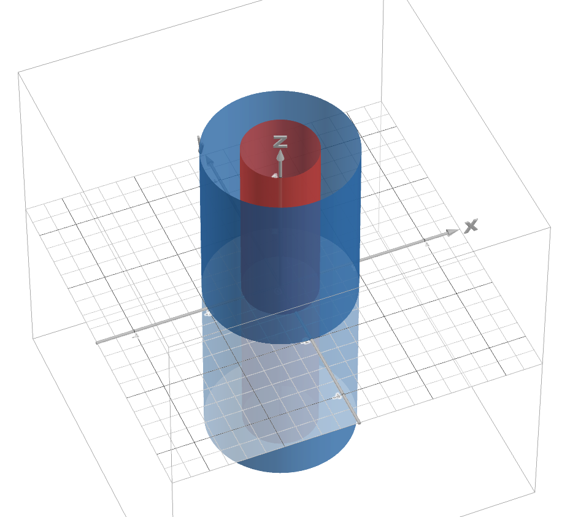
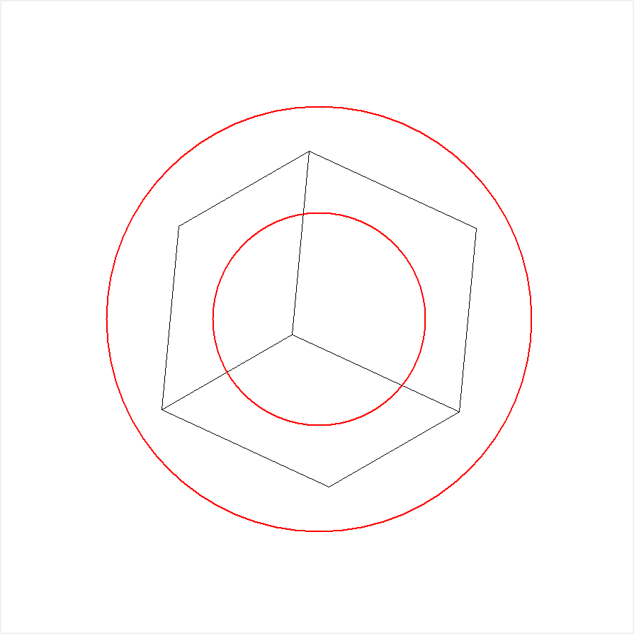

---
abstract: |
  Данный отчёт посвящён модификации эталонного проекта "Полиэдр". Решалась по нахождению суммы длин рёбер, удовлетворяющих определённому условию.
author: 
- Соколов Пётр, Б23-205
date: 2024
title: " Отчёт по модификации проекта Полиэдр"
...

# Содержание
- [Содержание](#содержание)
- [Команды для преобразования формата](#команды-для-преобразования-формата)
- [Постановка задачи](#постановка-задачи)
- [Описание решения](#описание-решения)
  - [Изменения в классе `R3`](#изменения-в-классе-r3)
  - [Изменения в классе `Polyedr`](#изменения-в-классе-polyedr)
  - [Изменения в `data` и `run_shadow.py`](#изменения-в-data-и-run_shadowpy)
- [Тесты](#Тесты)

# Команды для преобразования формата
1. `pandoc -s report.md -o report.docx` — для преобразования в *docx* файл;
2. `pandoc report.md -s --self-contained --template=default.html5 --mathjax -o report.html` — для преобразования в *html* файл;
3. `pandoc -s report.md -o report.pdf --template default.latex` — для преобразования в *pdf* файл.

# Постановка задачи
В данном проекте выполнялась задача 17 (список задач предоставлен по [ссылке](https://edu-support.mephi.ru/materials/293/html/labs/10/problems.md)).

Условие задачи звучит так: <br> Назовём точку в пространстве «хорошей», если её проекция находится строго внутри окружности $x^2 + y^2 = 4$,
 но строго вне окружности $x^2 + y^2 = 1$. Модифицируйте эталонный проект таким образом, чтобы определялась и печаталась следующая характеристика полиэдра: сумма длин рёбер, оба из концов которых не являются «хорошими» точками.

# Описание решения
Для решения поставленной задачи требовалось отслеживать попадание проекции каждой из вершин полиэдра в открытое кольцо с внутренним и внешним радиусами, равными 1 и 2 соотвественно (см. рис.1). После, если две данные вершины, имеющие общее ребро не попали в кольцо, то нужно было находить длину ребра, которе их соединяло (рассматриваются именно пары смежных вершин) и добавлять в общую сумму.



## Изменения в классе `R3`

Для этого в классе `R3`, в файле `r3.py`, добавили два метода:

1. `in_reg`, метод проверяющий попадание заданной точки в открытое кольцо;
2. `dist`, метод находящий расстояние между точками (оно и есть длина ребра).

Ниже представлен код данных методов.

код *первого метода*: <br>
```python
def in_reg(self):
  if ((self.x**2 + self.y**2)<4) and ((self.x**2 + self.y**2)>1):
      return True
  else:
      return False
```

код *второго метода*:
```python
def dist(self, other):
  x_l = (self.x - other.x)**2
  y_l = (self.y - other.y)**2
  z_l = (self.z - other.z)**2
  return sqrt((x_l + y_l + z_l))
```

## Изменения в классе `Polyedr`
Так как производилась модификация не оптимизированного кода эталонного проекта, то некоторые рёбра обрабатывались несколько раз. В таком случае, при работе с ними, мы бы получали неправильный результат.

Поэтому в класс был добавлен отдельный метод `edges_lenght`, который сначала удалял все повторяющиеся рёбра, оставляя лишь один экземпляр, а после обрабатывал оставшиеся и длины тех, что соответствовали поставленному условию, добавлял уже в итоговую сумму. Стоит отметить, что данный метод работал с неизменёнными координатами вершин, так как по условию проеобразование координат не изменяет сам полиэдр.

ниже приведён код данного метода: <br>
```python
def edges_lenght(self):
  edges = {}
  for e in self.edgest:
      a = e.beg
      b = e.fin
      if (a, b) not in edges and (a, b) not in edges:
          edges[(a, b)] = e
          if not (a.in_reg()) and not (b.in_reg()):
              self.s += a.dist(b)
  return self.s
```

## Изменения в `data` и `run_shadow.py`
Был добавлен ещё один полиэдр `new_box.geom`, который потребовался для тестирования правильности работы метода из класса `Polyedr`.

В `run_shadow.py` теперь отстраивается новый полиэдр и две окружности, составляющие открытое кольцо (см. рис.2), а также после каждого построения выводится искомая сумма.



# Тесты
Добавленные тесты для класса `R3`, проверяющие высчитываемое расстояние и условие принадлежности вершин открытому кольцу.

```python
def test_dist01(self):
        self.assertEqual(self.a1.dist(self.a2), 1)

    def test_dist02(self):
        self.assertAlmostEqual(self.a1.dist(self.a3), sqrt(3))

    def test_in_reg1(self):
        self.assertTrue(self.a4.in_reg())

    def test_in_reg2(self):
        self.assertFalse(self.a.in_reg())

```

Добавленные тесты для класса `Polyedr`. Ниже приведены тесты, проверяющие правильность высчитывания суммы для каждого из данных полиэдров, включая новый `new_box`.

```python
def test_sum01(self):
        p = Polyedr('data/box.geom').edges_lenght()
        self.assertEqual(p, 12.0)

    def test_sum02(self):
        p = Polyedr('data/ccc.geom').edges_lenght()
        self.assertEqual(p, 30.0)

    def test_sum03(self):
        p = Polyedr('data/king.geom').edges_lenght()
        a = 35.29536857
        self.assertAlmostEqual(p, a)

    def test_sum04(self):
        p = Polyedr('data/babem.geom').edges_lenght()
        a = 2324.05376815
        self.assertAlmostEqual(p, a)

    def test_sum05(self):
        p = Polyedr('data/cow.geom').edges_lenght()
        b = 976.4371654314
        self.assertAlmostEqual(p, b)

    def test_sum06(self):
        p = Polyedr('data/new_box.geom').edges_lenght()
        self.assertAlmostEqual(p, 0)
```
